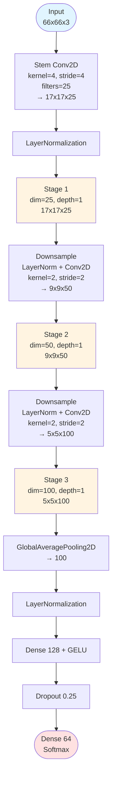
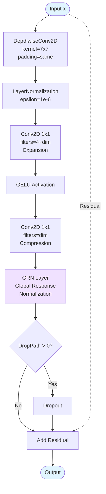
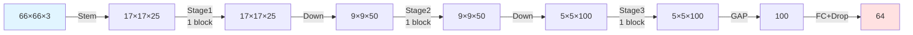
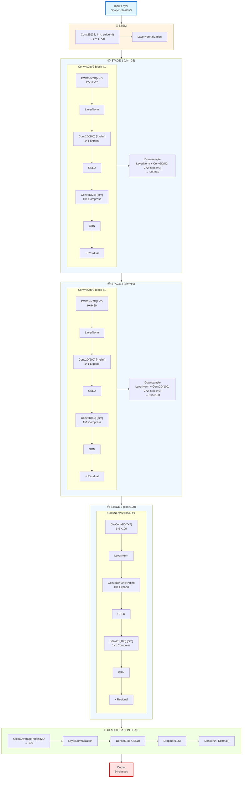

# Kiến Trúc ConvNeXtV2 - Cấu Hình Mặc Định

## Biểu Đồ Tổng Quan



## Chi Tiết ConvNeXtV2 Block



## Chi Tiết GRN (Global Response Normalization)

```mermaid
graph TB
    X([Input x]) --> Square[x²<br/>Element-wise Square]
    Square --> Sum[Sum axis=(1,2)<br/>Spatial Reduction]
    Sum --> Sqrt[√ + eps<br/>Compute Norm]
    Sqrt --> Mean[Mean axis=-1<br/>Channel Mean]
    Mean --> Div[nx / mean<br/>Normalized]
    
    X --> Mul[x * x_normed]
    Div --> Mul
    
    Mul --> Scale[γ * result]
    Scale --> AddBias[+ β]
    X --> AddRes[x + ...]
    AddBias --> AddRes
    AddRes --> Output([Output])
    
    style X fill:#e1f5ff
    style Output fill:#e1f5ff
```

## Bảng Thông Số Mặc Định

| Tham số | Giá trị | Mô tả |
|---------|---------|-------|
| `input_shape` | (66, 66, 3) | Kích thước đầu vào |
| `num_classes` | 64 | Số lớp phân loại |
| `dims` | [25, 50, 100] | Số filters mỗi stage |
| `depths` | [1, 1, 1] | Số blocks mỗi stage |
| `dropout` | 0.25 | Tỷ lệ dropout |
| `dense_dim` | 128 | Kích thước FC layer |

## Sơ Đồ Luồng Dữ Liệu



## Kiến Trúc Đầy Đủ - Chi Tiết Từng Layer



